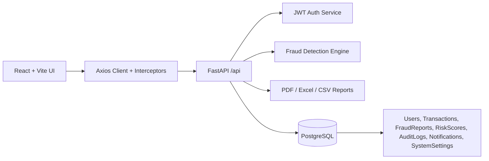
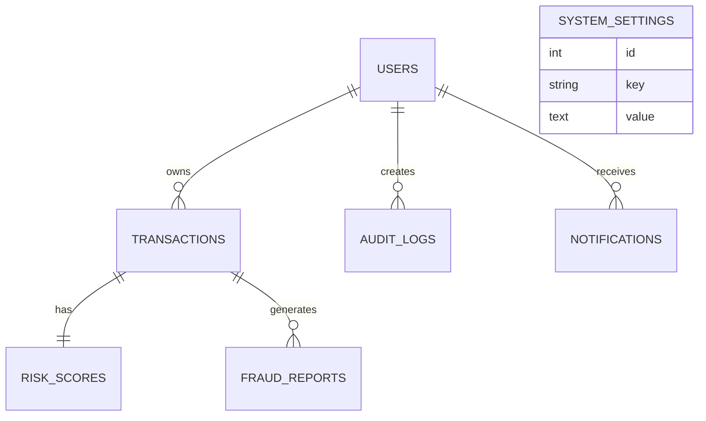

# FraudGuard Production Rebuild

FraudGuard is now structured as a production-oriented fraud detection platform with a React/Vite frontend, FastAPI backend, PostgreSQL persistence, JWT authentication, API-driven dashboard charts, file-based transaction detection, report exports, Docker deployment, CI, and tests.

## Existing Code Audit

- Frontend was a Create React App dashboard with Tailwind classes and Chart.js canvases. The visual design, navigation, cards, charts, alerts, upload panel, analytics page, and settings page were preserved.
- Dashboard cards, charts, alerts, analytics stats, and transaction list were hardcoded in React components.
- Backend was a single Flask app with `/api/detect`, pandas upload parsing, and static threshold classification.
- No database, auth, migrations, protected routes, global API client, refresh tokens, Docker deployment, CI pipeline, or production documentation existed.
- A checked-in `backend/venv` was present in the archive and intentionally excluded from the rebuilt workspace.

## Architecture



## ERD



## API Contracts

Auth:
- `POST /api/auth/register`
- `POST /api/auth/login`
- `POST /api/auth/logout`
- `POST /api/auth/refresh`
- `POST /api/auth/forgot-password`
- `POST /api/auth/reset-password`
- `POST /api/auth/verify-email`

Dashboard:
- `GET /api/dashboard/summary`
- `GET /api/dashboard/risk-overview`
- `GET /api/dashboard/transaction-trends`
- `GET /api/dashboard/fraud-analysis`
- `GET /api/dashboard/branch-comparison`
- `GET /api/dashboard/recent-transactions`
- `GET /api/dashboard/alerts`

Transactions:
- `POST /api/transactions`
- `GET /api/transactions`
- `GET /api/transactions/{id}`
- `PUT /api/transactions/{id}`
- `DELETE /api/transactions/{id}`
- `POST /api/transactions/detect`

Reports:
- `GET /api/reports/pdf`
- `GET /api/reports/excel`
- `GET /api/reports/csv`

## Environment Guide

Backend environment variables:
- `DATABASE_URL=postgresql+psycopg://fraudguard:fraudguard@db:5432/fraudguard`
- `SECRET_KEY=<strong random value>`
- `CORS_ORIGINS=["http://localhost:5173","http://localhost"]`
- `RATE_LIMIT=120/minute`

Frontend environment variables:
- `VITE_API_URL=/api`

## Development

Backend:

```bash
cd backend
pip install -r requirements.txt
DATABASE_URL=sqlite:///./dev.db SECRET_KEY=dev uvicorn app.main:app --reload
```

Frontend:

```bash
cd frontend
npm install
npm run dev
```

## Deployment

```bash
docker compose up --build
```

Frontend is served through nginx on port `80`, backend on port `8000`, and PostgreSQL runs as the `db` service.

## Security Controls

- JWT access and refresh token authentication
- bcrypt password hashing
- request rate limiting
- CORS allowlist
- CSP, frame, content-type, and referrer security headers
- Pydantic input validation
- SQLAlchemy parameterized queries
- HTML sanitization for user-facing string fields
- protected frontend routes

## Testing

Backend uses Pytest with coverage threshold configured in `backend/pytest.ini`.

Frontend uses Vitest and React Testing Library with coverage thresholds configured in `frontend/vite.config.js`.

```bash
cd backend && DATABASE_URL=sqlite:///./test.db SECRET_KEY=test pytest
cd frontend && npm run test
```
